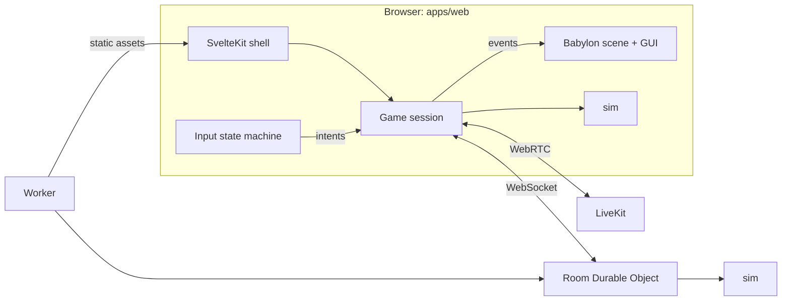

# Architecture

WebXR Pool is one web build that runs on every device, a Cloudflare Worker that serves it and hosts one Durable Object per room, and LiveKit for voice.

## Packages and dependency direction

| Package           | Contains                                                                             | May import                           |
| ----------------- | ------------------------------------------------------------------------------------ | ------------------------------------ |
| `packages/sim`    | Physics, rules, variant configs, table geometry parameters                           | nothing                              |
| `packages/shared` | Design tokens, settings schema, network message schemas                              | valibot                              |
| `apps/web`        | SvelteKit shell, Babylon scene, input, in-session GUI, settings store, local session | sim, shared, Babylon, LiveKit client |
| `apps/server`     | Worker routing, Room Durable Object, LiveKit token issuing                           | sim, shared                          |

The arrows only point downward. ESLint enforces the sim and shared boundaries.

## The game session interface

The single most important seam. Input produces intents (place bridge, aim, stroke, place cue ball). A game session turns intents into shot commands, runs the simulation and rules, and emits events (ball moved, collision, pocketed, turn changed, foul). The scene renders events. Two implementations:

- **Local session** for solo freestyle: runs sim in memory, no network.
- **Network session** for rooms: sends shot commands to the Room, replays the returned shot locally, snaps to the authoritative final state.

Input and rendering never know which one they are talking to. See [networking.md](networking.md) for the network side and [gameplay/interaction.md](gameplay/interaction.md) for the input side.

## Data flow for a shot

1. Input state machine reaches Stroke and emits a `stroke` intent with direction, power and tip offset.
2. Session validates it is this player's turn and builds a shot command.
3. Sim runs the shot to rest and returns an event list with timestamps plus final positions.
4. Rules module reads the events and the variant config and decides the turn outcome.
5. Scene animates from the event list; sound triggers from collision events.
6. In the network session, step 3 and 4 also run on the Room, whose result wins.

## Two user interfaces

The shell (SvelteKit, DOM) handles everything between games. The in-session interface (Babylon GUI) handles everything during a game and renders both fullscreen in flat mode and on a panel in VR. HTML cannot appear inside an immersive session. Details in [ui.md](ui.md).

## State

A framework-free settings store in `apps/web` is the single source of truth for settings and profile, backed by the shared settings schema. Both the shell and the Babylon scene subscribe to it. Room state lives in the Durable Object and is mirrored into the session.
