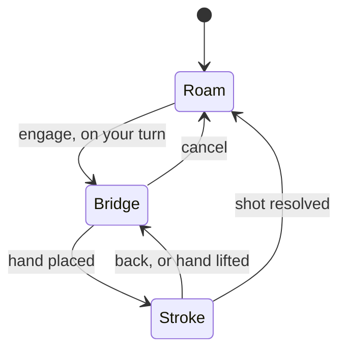

# Interaction model

Every platform uses the same three states: **Roam**, **Bridge**, **Stroke**. The states and their rules are identical; only how each is entered differs per device. A shot never requires navigation on flat devices, so Roam there is purely social.

## Roam

Walk and look around, talk. Persistent controls open the in-session menu, mute, and leave. On the player's turn an **engage** button appears. After a foul the same button reads **place cue ball**, and the player visibly carries the ball until it is placed using the Bridge mechanic with a ball instead of a hand (dominant hand in VR, legal zone from the variant config).

## Bridge

Movement and free look stop. On flat devices the camera moves to an overview of the cue ball. The player places the non-dominant hand on the table:

- A ghost hand model with fingers split for the cue previews the position, like a building placement in a strategy game.
- A faint, slowly pulsing trail of dots from the placement point through the cue ball shows the projected shot direction, because the bridge position decides most of the aim.
- Placement is limited to cue reach around the cue ball, about 40 cm, with the valid area faintly highlighted, and never inside a ball's footprint.
- Confirming drops the hand and enters Stroke.

## Stroke

- The cue appears seated in the bridge hand. The dot trail continues from the cue ball along the current direction and stops at the first cushion or ball. Whether it shows in Stroke is a **room option**, so every player in a room has the same assistance.
- A **contact dot** on the cue ball marks where the tip will strike, rendered on top of everything; it goes hollow when rotation carries it off the ball.
- Rotation pivots the cue about the bridge point. The usable cone is a few degrees (about 8° either way at 20 cm bridge distance, 3° at 50 cm), so Stroke sensitivity is far finer than look sensitivity; arrow keys nudge on desktop.
- The cue stays level. On flat devices the camera sits above and behind the cue looking down at the cue ball, cue in the lower centre of the screen; portrait and landscape get their own framing.
- The shot fires when the tip reaches the ball. When the balls stop, every platform returns to Roam.

## Per-platform controls

| Transition           | Touch                                            | Mouse and keyboard                       | VR controllers                                                                                                    |
| -------------------- | ------------------------------------------------ | ---------------------------------------- | ----------------------------------------------------------------------------------------------------------------- |
| Enter Bridge         | Engage button                                    | E                                        | Hold the non-dominant trigger near the table surface                                                              |
| Place the hand       | Touch the table, drag to adjust, lift the finger | Move the cursor, click                   | The hand drops to the surface under the controller; release the trigger                                           |
| Cancel Bridge        | Engage button again                              | E again                                  | Release the trigger away from the table                                                                           |
| Adjust aim           | Swipe                                            | Move the mouse; arrow keys nudge         | Move the dominant hand; the cue runs from the bridge to it                                                        |
| Set power and strike | Hold the power button, drag back, release        | Hold the left button, drag back, release | Squeeze the dominant grip to lock the direction, push the hand forward along the cue; speed at contact sets power |
| Back to Bridge       | Back button                                      | Esc                                      | Press the non-dominant trigger                                                                                    |

**Power on flat devices** is drag-to-set: hold, pull back to fill the bar, release to strike, return to the start to cancel. An oscillating timing bar is kept as an alternative to compare in the phase 2 prototype.

## VR specifics

- The hand model animates from an open pose to the bridge pose as it drops. Placement clamps to the nearest valid surface point, rails included, and does nothing if the controller is far from the table, which keeps the offset between real and shown hand small.
- The placed hand is anchored in world space. Physical movement is always allowed; thumbstick locomotion is disabled in Bridge and Stroke.
- **Leash**: a haptic tick as the real hand nears the limit; beyond about 40 cm from the placed hand, the hand lifts automatically and the state returns to Bridge.
- **Minimum hand distance**: a haptic cue when the dominant hand comes too close to the bridge point, where the cue direction is unstable.
- While locked, the dominant hand model slides along the cue axis with the projected motion; only the sideways component is discarded.
- Hand tracking is left for later; a pinch maps onto the trigger and the state machine is unchanged.

## Control scheme on flat devices

Flat devices cannot be classified reliably (a tablet may have a keyboard and mouse). The client guesses from pointer and hover media queries and touch-point count, then offers a device-scoped **control scheme** setting: touch, or mouse and keyboard. Three rules make a wrong choice harmless:

- Input listening is universal; the scheme only changes what is shown (on-screen buttons, hints, sensitivity defaults).
- A visible touch-friendly control that opens the in-session menu is always on screen, so a player without a keyboard is never stuck.
- Mismatched input prompts a one-tap switch.

## Freestyle and the session interface

The first playable build is single-player freestyle, kept as a permanent mode. Input emits intents to the game session interface; solo play implements it with a local in-memory session, multiplayer with the network session. See [../architecture.md](../architecture.md).
