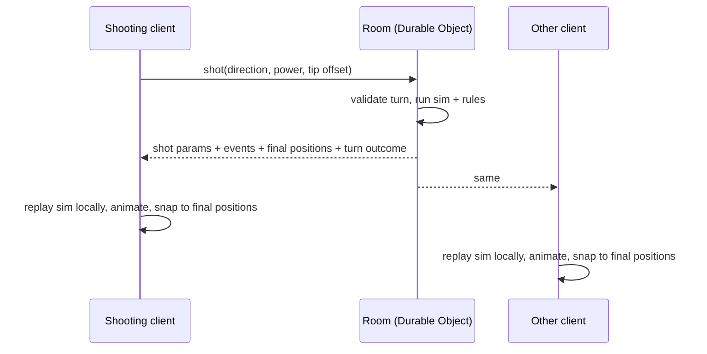

# Networking

Pool is turn-based and a shot is one input, so latency barely affects play. Three kinds of traffic: shots (rare, authoritative), poses and aim previews (continuous, cosmetic), voice (separate path through LiveKit).

## Shots: deterministic replay, authoritative server

Every client animates by running the same simulation from the same parameters, then snaps to the server's final positions. Drift between engines is sub-millimetre, so the snap is invisible.

## Continuous data

- Head and hand poses at about 15 Hz, interpolated on receipt.
- The active player's bridge position, cue direction and cue slide stream while aiming so others see the line-up.
- Fire-and-forget; a dropped update is replaced by the next.

## Rooms

- A room is a URL such as `/r/ABCD`; sharing the link is the invitation.
- Two players per room in version one. Spectators and more players are a later expansion.
- The Room holds the full state and sends a snapshot to reconnecting or late-joining clients.
- The Room is destroyed as soon as its last player disconnects. Links are not reusable.
- The Room issues a short-lived LiveKit token on join so the voice room equals the game room.

## Identity

No accounts in version one. A guest id generated on first visit lives in local storage (profile scope) and lets a refresh rejoin the same seat.

## Messages

All message shapes are valibot schemas in `packages/shared`, validated on both ends. Message kinds planned for phase 4: join, snapshot, shot, shot-result, pose, aim, turn, leave, error. Each carries a protocol version.
