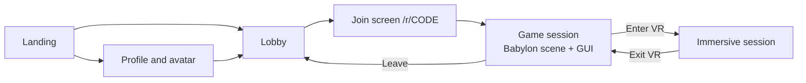

# User interface

Two interfaces, two technologies, one hard line: a **flat shell** in SvelteKit for everything between games, and an **in-session interface** drawn by Babylon GUI for everything during a game. HTML cannot appear inside an immersive session.

## The shell (SvelteKit, DOM)

Owns identity and meta: username, avatar editor, lobby and room list, invites, the join screen (with the microphone on/off choice), and eventually accounts. Always a flat page, used on every device; on a headset the browser shows it as a floating window driven by a laser pointer, so: large targets, no hover-only interactions, nothing that depends on precise typing. The avatar editor may embed a small Babylon canvas so the preview matches the in-game model.

Routes: landing, lobby, profile, and the client-only game route `/r/[code]` which disables SSR and mounts Babylon inside `onMount`. SvelteKit is used for routing, a prerendered landing page and per-route link preview tags; search ranking is not a goal.

## The in-session interface (Babylon GUI)

One control tree that renders fullscreen over the canvas in flat mode and onto a panel in front of the player in VR. Holds graphics quality, sensitivity, control scheme, comfort options, microphone mute and selection, handedness, restart rack, leave room, and the room options the host controls (aim trail in Stroke). Layouts may be authored in Babylon's GUI Editor (there is an MCP server for it) and loaded from JSON, then themed from tokens.

Rule for what goes where: **between games** is the shell, **during a game** is in-world. The only DOM element that crosses the line is the Enter VR button.

## Design tokens

One TypeScript module in `packages/shared` defines semantic colours (surface, text, accent, danger…), font family, a type scale, spacing steps and corner radii. Dark theme only in version one.

- The shell gets a generated CSS file of custom properties from a small pre-build script. Components use `var(--color-accent)`, never literals.
- Babylon GUI imports the token object; a theme helper applies values per control type, including to layouts loaded from JSON.
- The web font is loaded through the Font Loading API before the first GUI frame, since Babylon GUI draws text through a 2D canvas.
- Tokens carry proportions, not pixel sizes; the theme helper multiplies the type scale per surface (flat vs VR panel).

## Settings

Every setting is declared once in the shared schema with a scope, default and validator.

| Scope   | Examples                                                                                                           | Storage now                    | With accounts                  |
| ------- | ------------------------------------------------------------------------------------------------------------------ | ------------------------------ | ------------------------------ |
| Device  | Control scheme, graphics quality, shadows, sensitivity, snap turning, microphone device, microphone on/off at join | Local storage                  | Local storage, never synced    |
| Profile | Username, avatar, handedness, preferred variant                                                                    | Local storage under a guest id | Server, local storage as cache |
| Session | Microphone muted, current room                                                                                     | Memory                         | Memory                         |

- Device defaults come from detection at first run: headsets low quality tier, phones medium, desktops high.
- Profile values start under an anonymous guest id; signing up later uploads the guest profile.
- Stored blobs carry a version and a migration; values are validated on read and fall back to defaults.
- A framework-free store in `apps/web` is the single source of truth; the shell and the scene both subscribe to it.
